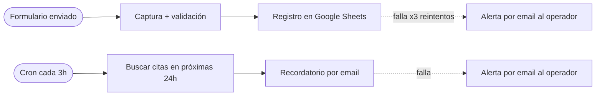
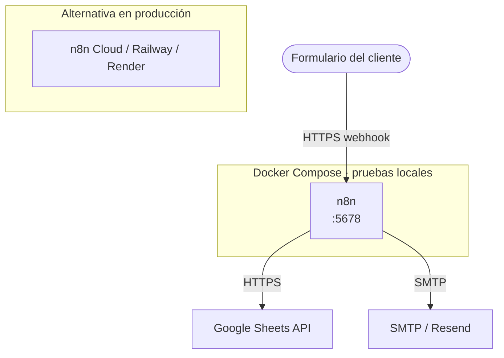

# Diagramas — Nivel Basic

> Esta rama solo trae el nivel Basic (2 flujos). Standard y Premium viven en las ramas
> `nivel-standard` y `nivel-premium` — cada una tiene su propio `docs/DIAGRAMAS.md` con el alcance
> correspondiente. Versión interactiva del sistema completo (con pestañas por nivel):
> **[Anatomía del Pipeline](https://claude.ai/code/artifact/7fbda57d-0aee-4dc9-82d1-dc943924b19c)**.
>
> Cómo leer los diagramas: `( )` disparador (webhook/cron) · `[ ]` paso de proceso · `{ }` decisión ·
> flecha continua = flujo normal · flecha punteada = manejo de error.

## 1. Diagrama de flujo (nivel técnico)

La lógica nodo por nodo de los 2 workflows de `flows/basic/`.

Los 2 flujos son independientes entre sí — cada uno con su propio disparador y su propio manejo de
error local (reintento + email), sin un canal de errores centralizado (eso llega en Standard).

## 2. Diagrama de proceso (nivel de negocio)

Dos procesos cortos y paralelos, sin scoring, sin CRM y sin seguimiento automático a leads fríos
— esas piezas aparecen en Standard y Premium respectivamente (ver `nivel-standard` /
`nivel-premium`).

## 3. Diagrama de infraestructura (nivel de despliegue)

Un solo contenedor (n8n) y dos integraciones externas — nada de base de datos propia, CRM,
WhatsApp ni Slack todavía.

### Partes del sistema (infraestructura)

| Componente | Variables de entorno |
|---|---|
| n8n (orquestador) | `N8N_HOST`, `N8N_API_KEY` |
| Google Sheets API | `GOOGLE_SHEETS_DOCUMENT_ID`, `GOOGLE_SHEETS_CREDENTIALS` |
| SMTP | `ALERTS_FROM_EMAIL`, `ALERTS_TO_EMAIL` |

---

Generado a partir del contenido real de `flows/basic/`, `docker-compose.yml` y `.env.example` de
esta rama — nombres de nodo y rutas de webhook son los del código, no ilustrativos.
