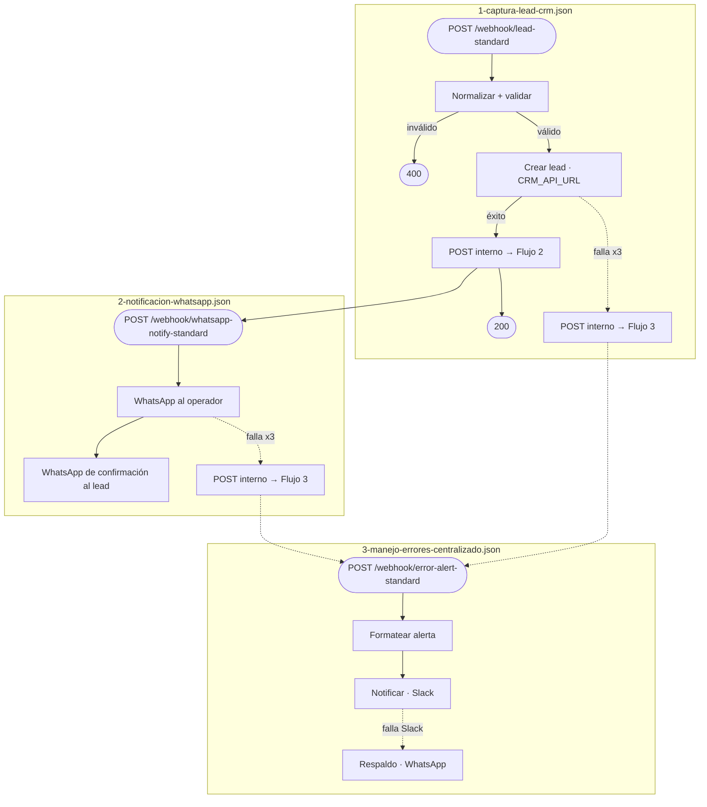
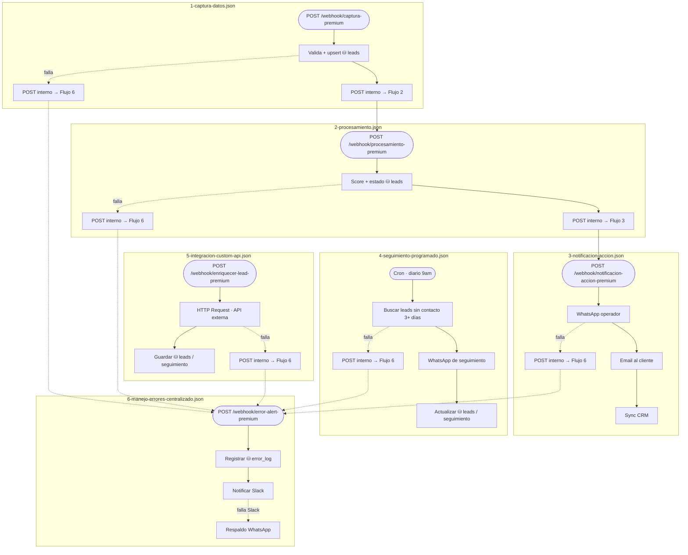
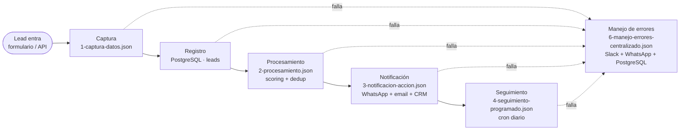
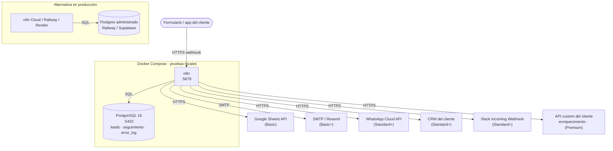

# Diagramas — Sistema completo (Basic + Standard + Premium)

> Rama `nivel-premium`: cubre las 11 piezas del repo (2 flujos Basic + 3 Standard + 6 Premium).
> Versión interactiva (con pestañas por nivel y navegación): **[Anatomía del Pipeline](https://claude.ai/code/artifact/7fbda57d-0aee-4dc9-82d1-dc943924b19c)**.
>
> Cómo leer los diagramas: `( )` disparador (webhook/cron) · `[ ]` paso de proceso · `{ }` decisión ·
> ⛁ base de datos · flecha continua = flujo normal · flecha punteada = manejo de error.

## 1. Diagrama de flujo (nivel técnico)

La lógica nodo por nodo de cada workflow de n8n.

### Nivel Basic — `flows/basic/`

### Nivel Standard — `flows/standard/`

### Nivel Premium — `flows/premium/`

## 2. Diagrama de proceso (nivel de negocio)

El ciclo de vida de un lead en Premium, sin nodos de n8n de por medio — qué flujo implementa cada
etapa, y cómo el manejo de errores cruza todas las etapas en vez de vivir dentro de una sola.

> El Flujo 5 (`5-integracion-custom-api.json`, enriquecimiento vía API externa) no vive en esta
> cadena principal — se dispara aparte, normalmente llamado desde el paso de Procesamiento cuando
> el cliente lo necesita. Ver `flows/premium/README.md`.

En Basic y Standard el mismo proceso existe pero más corto — sin **Procesamiento** (scoring) ni
**Seguimiento a leads fríos** (Premium-only). Basic guarda en Sheets en vez de PostgreSQL y solo
notifica por email; Standard guarda en el CRM y notifica por WhatsApp.

| Etapa | Basic | Standard | Premium |
|---|---|---|---|
| Captura | Webhook + validación | igual | igual |
| Registro | Google Sheets | CRM del cliente | PostgreSQL |
| Procesamiento | — | — | Scoring + deduplicación |
| Notificación | Email (solo si falla) | WhatsApp + confirmación al lead | + sync automático con CRM |
| Seguimiento | Recordatorio de cita (flujo aparte) | — | Leads fríos cada 3 días (cron) |
| Manejo de errores | Reintento local + email | Flujo centralizado (Slack + WhatsApp) | + registro en `error_log` (Postgres) |

## 3. Diagrama de infraestructura (nivel de despliegue)

En local, `docker-compose.yml` levanta n8n + PostgreSQL en la misma red y aplica `db/schema.sql`
automáticamente. En producción, n8n corre en n8n Cloud o un servicio como Railway/Render, y la base
en un Postgres administrado — las integraciones externas (columna derecha) son las mismas en ambos
casos.

### Partes del sistema (infraestructura)

| Componente | Nivel | Variables de entorno |
|---|---|---|
| n8n (orquestador) | Basic+ | `N8N_HOST`, `N8N_API_KEY`, `N8N_INTERNAL_URL` |
| PostgreSQL | Premium | `DATABASE_URL` — ver `db/schema.sql` |
| Google Sheets API | Basic | `GOOGLE_SHEETS_DOCUMENT_ID`, `GOOGLE_SHEETS_CREDENTIALS` |
| SMTP | Basic+ | `ALERTS_FROM_EMAIL`, `ALERTS_TO_EMAIL` |
| WhatsApp Cloud API | Standard+ | `WHATSAPP_TOKEN`, `WHATSAPP_PHONE_ID`, `WHATSAPP_OPERATOR_NUMBER` |
| CRM del cliente | Standard+ | `CRM_API_URL`, `CRM_API_KEY` |
| Slack | Standard+ | `SLACK_WEBHOOK_URL` |
| API custom | Premium | `CUSTOM_API_URL`, `CUSTOM_API_KEY` |

---

Generado a partir del contenido real de `flows/`, `db/schema.sql`, `docker-compose.yml` y
`.env.example` de esta rama — nombres de nodo y rutas de webhook son los del código, no ilustrativos.
