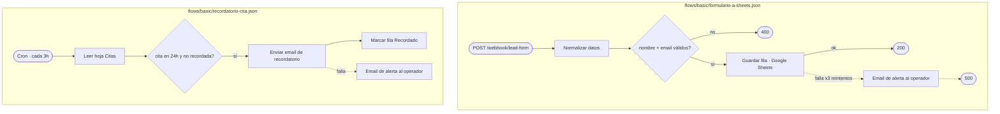
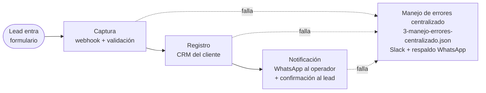
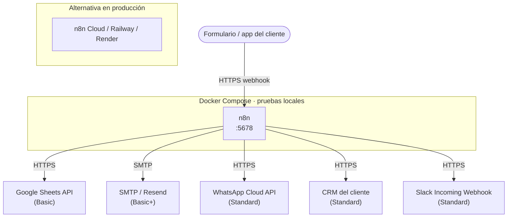

# Diagramas — Basic + Standard

> Rama `nivel-standard`: cubre las 5 piezas del repo (2 flujos Basic + 3 Standard). El nivel Premium
> (PostgreSQL, arquitectura de 6 flujos) no existe en esta rama — ver `nivel-premium` para el sistema
> completo, incluida la versión interactiva con pestañas por nivel:
> **[Anatomía del Pipeline](https://claude.ai/code/artifact/7fbda57d-0aee-4dc9-82d1-dc943924b19c)**.
>
> Cómo leer los diagramas: `( )` disparador (webhook/cron) · `[ ]` paso de proceso · `{ }` decisión ·
> flecha continua = flujo normal · flecha punteada = manejo de error.

## 1. Diagrama de flujo (nivel técnico)

La lógica nodo por nodo de cada workflow de n8n.

### Nivel Basic — `flows/basic/`

### Nivel Standard — `flows/standard/`

## 2. Diagrama de proceso (nivel de negocio)

El ciclo de vida de un lead en esta rama, sin nodos de n8n de por medio.

Aparte de esta cadena, `flows/basic/recordatorio-cita.json` corre su propio ciclo independiente
(cron → buscar citas próximas → recordatorio por email → falla → alerta por email) — no está
conectado al Flujo 3 de Standard, tiene su propio manejo de error local.

| Etapa | Basic | Standard |
|---|---|---|
| Captura | Webhook + validación | igual |
| Registro | Google Sheets | CRM del cliente |
| Procesamiento (scoring) | — | — *(solo Premium)* |
| Notificación | Email (solo si falla) | WhatsApp + confirmación al lead |
| Seguimiento | Recordatorio de cita (flujo aparte) | — *(seguimiento a leads fríos es Premium)* |
| Manejo de errores | Reintento local + email | Flujo centralizado (Slack + WhatsApp) |

## 3. Diagrama de infraestructura (nivel de despliegue)

Sin base de datos propia en este nivel: Basic escribe en Google Sheets y Standard en el CRM del
cliente. PostgreSQL entra recién en Premium (ver `nivel-premium`).

### Partes del sistema (infraestructura)

| Componente | Nivel | Variables de entorno |
|---|---|---|
| n8n (orquestador) | Basic+ | `N8N_HOST`, `N8N_API_KEY`, `N8N_INTERNAL_URL` |
| Google Sheets API | Basic | `GOOGLE_SHEETS_DOCUMENT_ID`, `GOOGLE_SHEETS_CREDENTIALS` |
| SMTP | Basic+ | `ALERTS_FROM_EMAIL`, `ALERTS_TO_EMAIL` |
| WhatsApp Cloud API | Standard | `WHATSAPP_TOKEN`, `WHATSAPP_PHONE_ID`, `WHATSAPP_OPERATOR_NUMBER` |
| CRM del cliente | Standard | `CRM_API_URL`, `CRM_API_KEY` |
| Slack | Standard | `SLACK_WEBHOOK_URL` |

---

Generado a partir del contenido real de `flows/`, `docker-compose.yml` y `.env.example` de esta
rama — nombres de nodo y rutas de webhook son los del código, no ilustrativos.
