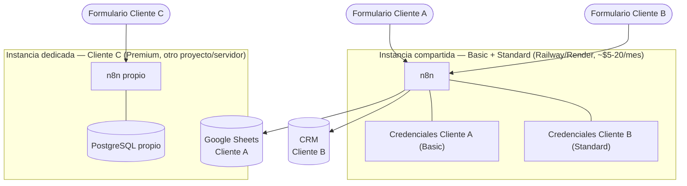

# Infraestructura multi-cliente

> Cómo montar esto cuando ya no es "mi proyecto de prueba" sino varios clientes reales pagando —
> uno Basic, uno Standard, uno Premium — al mismo tiempo. Qué se comparte entre ellos, qué nunca, y
> qué necesitas por cada uno.

## La decisión de fondo

No es solo técnica, es de riesgo y de modelo de negocio: ¿una instancia de n8n para todos los
clientes, o una por cliente?

- **Instancia compartida** (todos los clientes en el mismo n8n): más barata y simple de mantener,
  pero si se cae o se ve comprometida, **todos** los clientes se caen a la vez; un flujo lento o en
  loop de un cliente puede afectar a los demás; y todas las credenciales quedan cifradas con la
  misma `N8N_ENCRYPTION_KEY` del contenedor.
- **Instancia por cliente**: aislamiento total, pero cada una cuesta dinero y mantenimiento — no se
  justifica para un cliente Basic de $60 con 1 flujo.

Por eso el modelo recomendado es **híbrido**, no todo-compartido ni todo-separado (ver más abajo).

## Regla dura: qué NUNCA se comparte entre clientes

Aplica sin importar el modelo de hosting que elijas:

- **Credenciales** — Google Sheets OAuth, API key del CRM, token de WhatsApp, usuario/password
  SMTP. Cada cliente las suyas, siempre.
- **El número de WhatsApp Business** — es del negocio del cliente, no el tuyo (Meta además lo
  espera así: el perfil del número debe ser el del negocio real).
- **Los datos** — la Sheet, la base de datos, las filas de leads. Un cliente jamás debe poder ver
  (ni indirectamente, por un bug de flujo) los datos de otro.
- **La base de datos física en Premium** — nunca un Postgres compartido entre dos clientes
  Premium, aunque sea "solo" con tablas distintas. Un `DROP`/restore mal hecho, o una query sin
  `WHERE`, mezcla o borra datos de otro cliente.

## Qué sí se puede compartir con seguridad

- **El motor de n8n** (el software/contenedor) — mientras cada cliente tenga credenciales nombradas
  distinto (`Google Sheets - Cliente A`, `CRM - Cliente B`, …) y workflows importados con prefijo
  del cliente en el nombre.
- **El servidor/VM** donde corre ese n8n — para volumen bajo (pocos leads/día), un VPS pequeño
  aguanta varios clientes Basic/Standard sin problema.
- **Tu canal de monitoreo interno** (Slack tuyo, no del cliente) donde te llegan todas las alertas
  de error de todos los clientes, etiquetadas por cliente — distinto del canal que ve el cliente.
- **El dominio raíz**, si compartes instancia — cada cliente cuelga de una ruta distinta
  (`/webhook/clienteA-lead-form`, `/webhook/clienteB-lead-form`).

## Matriz de infraestructura por nivel

| | **Basic** | **Standard** | **Premium** |
|---|---|---|---|
| n8n | Compartido con otros Basic/Standard | Compartido, salvo que el cliente pida exclusividad | **Dedicado** (su propio contenedor/VM) |
| Base de datos | Ninguna (Sheets del cliente) | Ninguna (CRM del cliente) | **PostgreSQL dedicado** — nunca compartido |
| Credenciales nuevas | Google Sheets, SMTP | + WhatsApp Cloud API, CRM, Slack | + API custom del cliente |
| Dominio/subdominio | No necesario | No necesario (opcional) | Recomendado — subdominio propio |
| Backups | No crítico | No crítico | **Sí, regulares** — parte del soporte de 30 días |
| Por qué aislar | No se justifica el costo | Depende del volumen/criticidad | Precio, soporte contratado y riesgo de mezclar datos en BD lo justifican |

**La señal para dejar de compartir infraestructura no es el nivel en sí, es el riesgo/volumen
real**: si un cliente Standard empieza a mandar cientos de leads al día, o pide contractualmente
aislamiento, se gana su propia instancia aunque solo pague Standard.

## Arquitectura recomendada

- **Instancia compartida**: corre el `docker-compose.yml` de la rama `claude/sharp-edison-a5wvfq`
  o `nivel-standard`, con los workflows de **todos** tus clientes Basic/Standard importados ahí,
  cada uno con sus propias credenciales namespaced.
- **Por cada cliente Premium**: un despliegue *separado* del `Dockerfile`/`docker-compose.yml` de
  la rama `nivel-premium` — otro proyecto en Railway/Render, con su propio `.env` y su propio
  Postgres. Literalmente repites el mismo despliegue que ya armamos, una vez por cliente Premium.

Costo aproximado: un costo base fijo (instancia compartida, ~$5-20/mes) + un costo adicional por
cada cliente Premium (otra instancia + otro Postgres, ~$5-20/mes más cada uno). Ese costo extra hay
que meterlo en el margen al cotizar el paquete Premium.

## Checklist al llegar un cliente nuevo

- [ ] Decidir: ¿entra a la instancia compartida o necesita una dedicada? (Basic/Standard →
      compartida por defecto; Premium → dedicada por defecto)
- [ ] Crear sus credenciales con nombre único (`<Servicio> - <Cliente>`), nunca reusar una existente
- [ ] Importar sus flujos con el webhook `path` prefijado con su nombre/slug
      (`lead-form-clienteX`, no `lead-form` a secas, si comparte instancia con otros)
- [ ] Si es Premium: levantar su Postgres dedicado y aplicar `db/schema.sql`
- [ ] Agregar sus alertas de error a tu canal de monitoreo interno, etiquetadas con su nombre
- [ ] Completar `templates/docs-basico.md` (+ `guia-capacitacion.md` / `mantenimiento-30-dias.md`
      según el nivel) con sus datos reales

---

Ver también `docs/DIAGRAMAS.md` para el diagrama de infraestructura de una sola instalación, y
`INSTRUCCIONES_LOCAL.md` para levantar el `docker-compose.yml` de referencia que cada despliegue
real (compartido o dedicado) replica.
